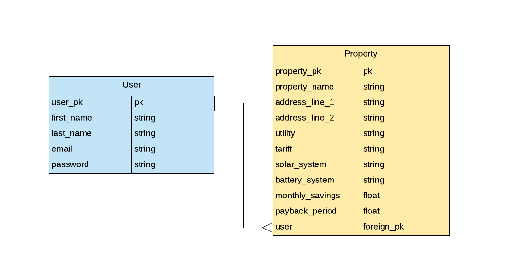
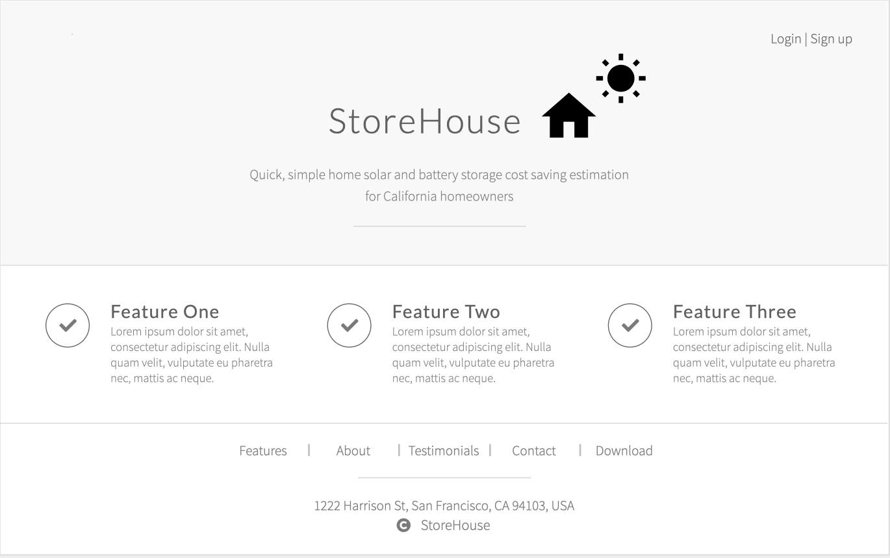
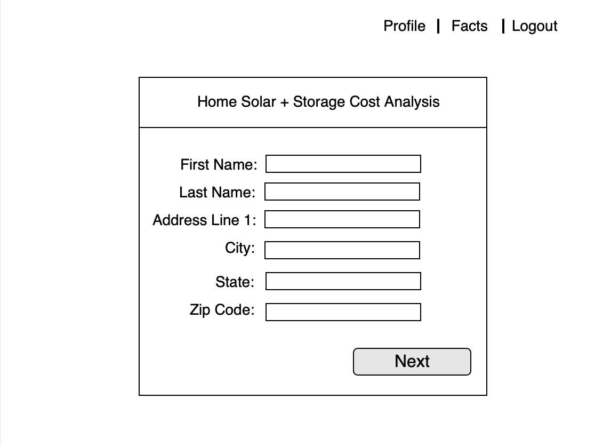
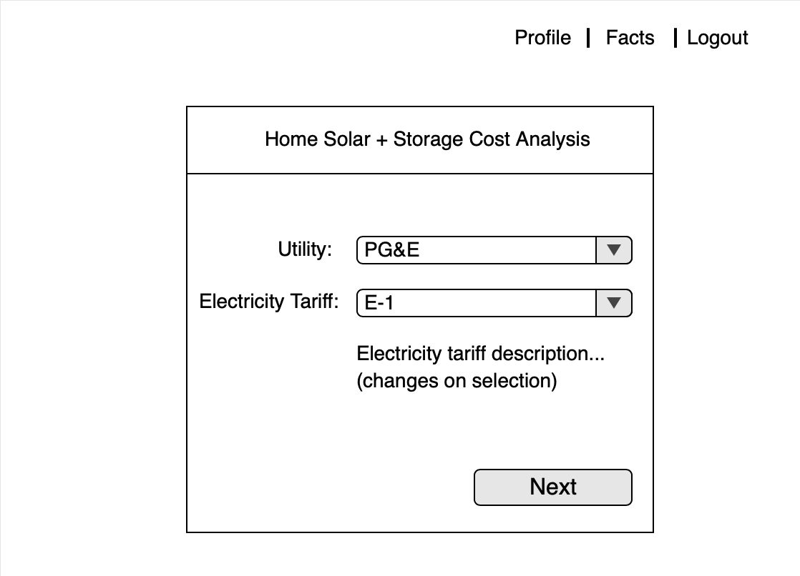
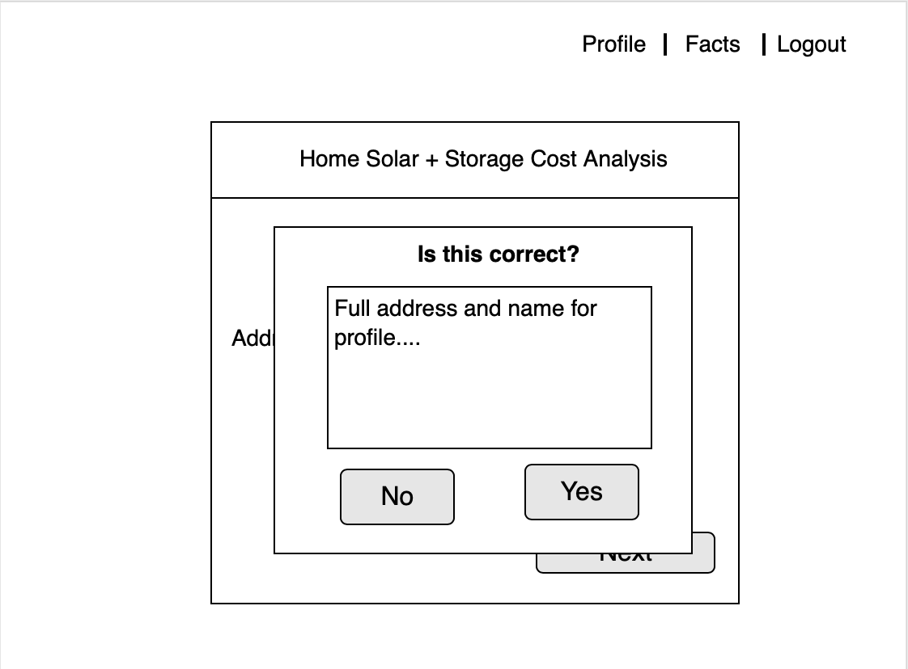
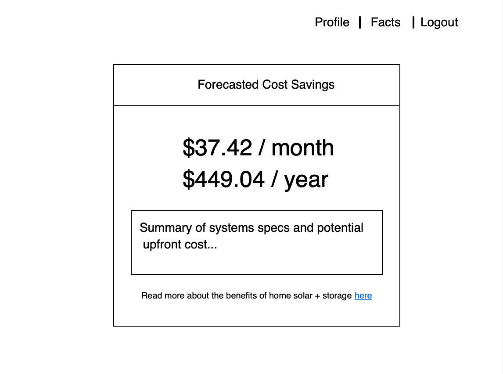

# StoreHouse

A full stack application for homeowners to assess potential savings from installing a home solar and battery system. My capstone project for General Assembly's Software Engineering Immersive, June-September 2019.

## Technologies Used

- Python
- Flask
- Postgres
- React
- OSESMO https://github.com/RyanCMann/OSESMO
- Genability Switch https://www.genability.com/switch/

---

## User Description

Home and business owners in California that are interested in understanding the cost/benefits of installing clean tech on their property(ies).

## User Story

1. (If not already logged in) Users arrive at the landing page, where they are directed to create an account or login. After creating an account they are directly logged into the system.
2. From the logged in page users can view their previously quoted properties or proceed to add a new property.
3. Click on a property brings up it's view in a modal, with more detail.
User proceeds through the onboarding process:
4. When a user clicks to add a new property, they are walked through the onboarding process:

- Enter their address
- Confirm utility and tariff status, or select from a list
- Enter last 3 months electricity bills
- Select solar system
- Select storage system
- Confirm submit

4. User is presented with the results of cost savings/per month, as well as the simple payback period of the system.

---

## Entity Relationship Diagram

---

## Wireframes

#### Landing

#### Onboarding

#### Savings Presentation

&copy; Jackson Herron 2019
